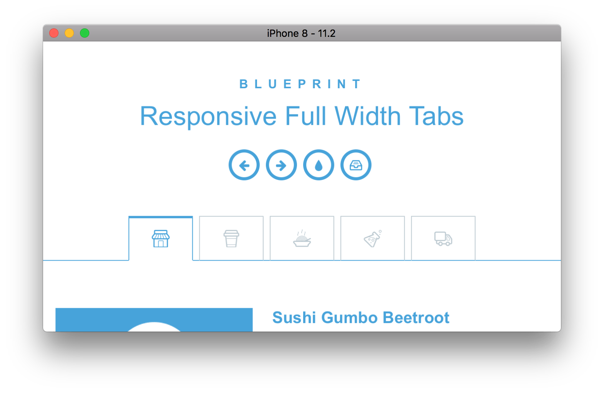
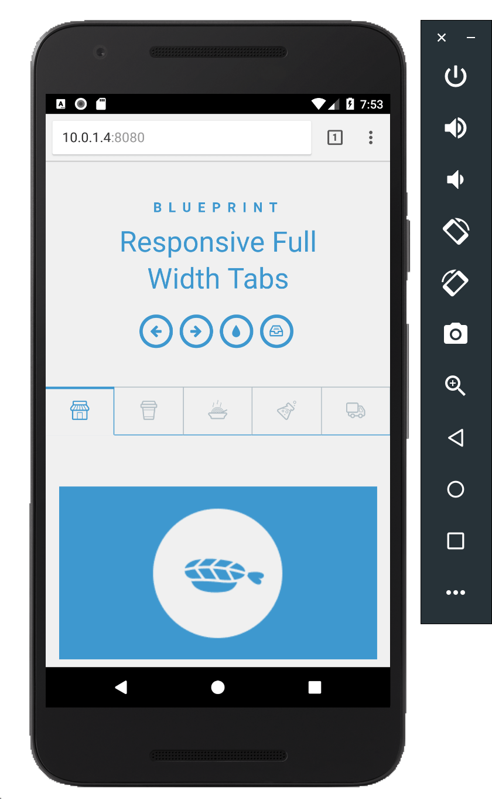

# React Native CSS modules with CSS Media Queries example

**Quick links:** **[Features](#example-app-features)** • **[Screenshots](#screenshots)** • **[Documentation](https://github.com/kristerkari/react-native-css-modules#documentation)** • **[Try it](#try-it)**

<a href="https://facebook.github.io/react-native/"></a><a href="https://github.com/css-modules/css-modules"></a>

This example app re-implements ["Responsive Full Width Tabs" demo](https://tympanus.net/Blueprints/FullWidthTabs/) from Tympanus Codrops website in React Native.

The example app should look and work exactly the same way in both browser and React Native.

To see code examples, have a look at [styles.css](/src/styles.css) and [App.js](/src/App.js) inside [src](/src) folder.

## Example App features

#### React Native and Web

* Uses the same CSS Media Queries for responsive scaling in both React Native and Web.
* Allows you to use both `className={myStyles.myClass}` and `style={{ color: "red" }}` properties on React Native elements such as `<Text>` or `<View>`.
* [Supports 2 syntaxes for using multiple CSS classes](https://github.com/kristerkari/babel-plugin-react-native-classname-to-style#multiple-classes) that work with React Native CSS modules and regular CSS modules.
* CSS Hot reloading.
* Uses [Sass](src/Buttons.scss) and [CSS](src/ProfileCard.css) for styles, but you can choose which one to use.
* [Uses custom stylelint config for React Native CSS modules](https://github.com/kristerkari/stylelint-config-react-native-css-modules)

#### React Native specific

* Uses [React Native CSS modules](https://github.com/kristerkari/react-native-css-modules)
* You can use platform specific file extensions, e.g. `styles.ios.scss`, `styles.android.scss`, `styles.native.scss`.

#### Web specific

* Uses [Webpack](https://webpack.js.org/) + [CSS modules](https://github.com/css-modules/css-modules).
* Uses [React Native for Web](https://github.com/necolas/react-native-web) to make most React Native elements work in the browser.

## Try it

### Step 1: Install depencies to run React Native

Make sure that you have `react-native-cli` installed and [XCode](https://developer.apple.com/xcode/)/[Android Studio](https://developer.android.com/studio/index.html) installed and working.

* Go to "Building Projects with Native Code" tab and follow the guide: https://facebook.github.io/react-native/docs/getting-started.html

### Step 2: Clone this repo

```sh
git clone git@github.com:kristerkari/react-native-css-modules-with-media-queries-example.git
```

### Step 3: Move to project and install project dependencies

```sh
cd react-native-css-modules-with-media-queries-example
```

```sh
npm install
```

or if you use Yarn:

```sh
yarn install
```

### Step 4: Run React native packager

You can open a new terminal tab for the packager.

```sh
npm start
```

or if you use Yarn:

```sh
yarn start
```

### Step 5: Run App on Android/iOS/Web

First make sure that your Android emulator or iOS simulator is working, then:

```sh
npm run ios
```

or

```sh
npm run android
```

or

```sh
npm run web
```

or if you use Yarn:

```sh
yarn ios
```

## Screenshots

### iPhone 8

**Left: iOS Safari browser**<br>
**Right: React Native**




### iPad 5G

**Left: iOS Safari browser**<br>
**Right: React Native**


### Android Nexus 5X

**Left: Android Chrome browser**<br>
**Right: React Native**



